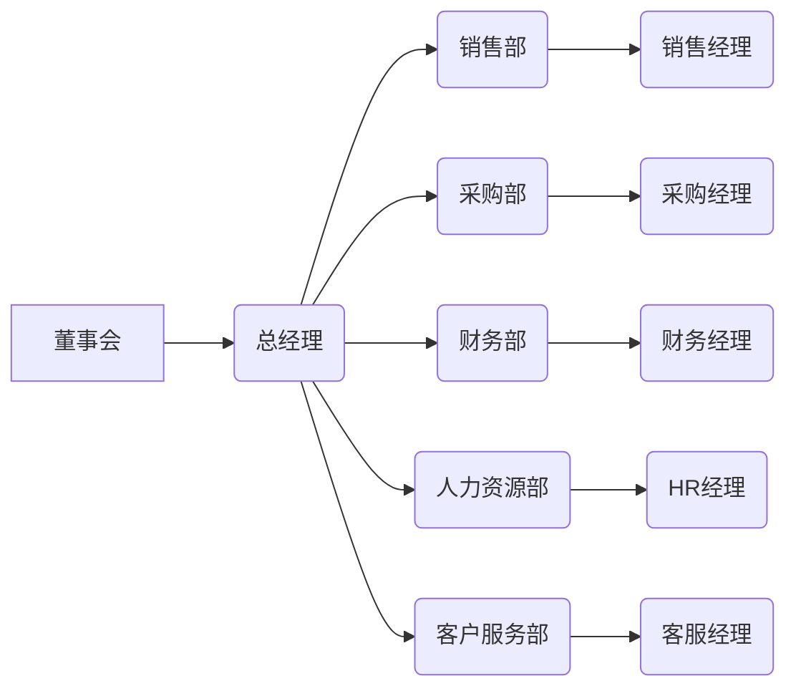
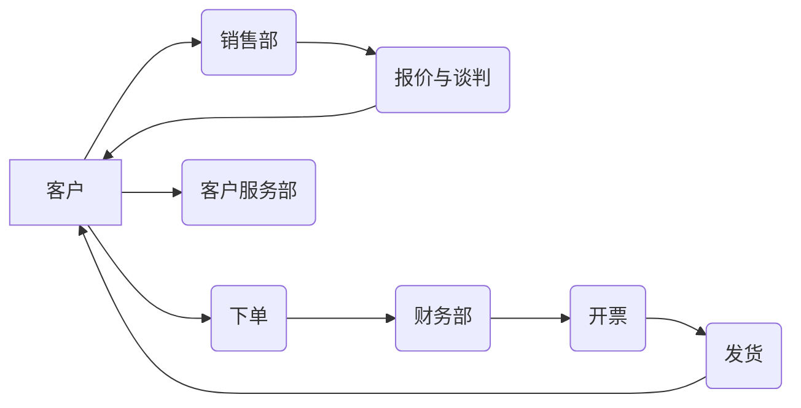
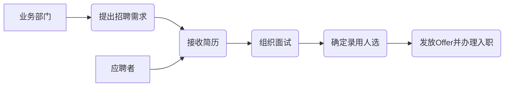
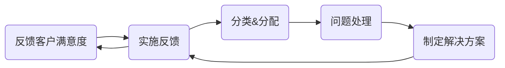

# 企业管理手册

## 执行摘要
本手册适用于假设规模为50–200人的中小型企业，旨在提供全面的管理制度和流程指南。内容涵盖公司简介、使命愿景、组织架构、岗位职责、核心业务流程、内部制度、合规风险管理、表单模板、实施培训与版本控制等，并明确每个部分的目标、关键要点、责任人、流程步骤、所需表单、合规要点和KPI指标。文中引用主要法律法规和权威来源，为HR和管理层提供可操作参考。以下内容可直接复制为Markdown文件，以便打印或分发使用。

## 公司简介与使命愿景
- **目标**：阐述公司基本情况、发展历程、使命、愿景和核心价值观，帮助员工快速了解企业背景和战略定位。  
- **关键要点**：公司名称、成立时间、行业领域、主营业务；使命（企业存在的根本目的），愿景（长远发展目标），核心价值观（文化理念）。  
- **责任人/岗位**：由董事会或总经理办公室负责制定和定期评估，并由HR发布。  
- **流程步骤**：董事会制订战略后，总经理确定使命和愿景文案，讨论后形成正式文件；公布于员工手册和官网；定期回顾更新。  
- **所需表单/模板**：企业简介模板、领导寄语文案。  
- **合规要点**：企业简介中不得出现虚假宣传；须符合工商登记的经营范围和行业政策。  
- **KPI**：员工对企业文化的认知度（调查反馈）、年度战略目标达成率。

## 组织架构
- **目标**：明确公司部门设置和汇报关系，展现组织层级和职责范围，便于沟通和管理。  
- **关键要点**：部门划分（如销售部、采购部、财务部、人力资源部、客户服务部、运营部等），各部门职责总览。  
- **责任人/岗位**：总经理制订并批准组织架构；各部门负责人落实调整。  
- **流程步骤**：根据企业规模和业务需求设计架构图，总经理审批后发布；每年评估一次架构适用性，必要时调整。  
- **所需表单/模板**：组织架构设计表（如部门职责描述表）。  
- **合规要点**：遵守国家关于企业法人治理结构的规定；职位设置不得违反法律对男女平等、劳工保护的要求。  
- **KPI**：组织架构调整次数、管理层覆盖率（管理者对下属比例）。  

组织架构示例如下（可用Mermaid图）：



## 岗位职责说明
- **目标**：明确各岗位的职能和要求，避免职责交叉遗漏，为招聘和绩效考核提供依据。  
- **关键要点**：岗位名称、汇报对象、主要职责、权责范围、任职要求（学历、经验、技能等）。  
- **责任人/岗位**：HR部门负责汇总、编写并归档；部门负责人参与岗位职责定义。  
- **流程步骤**：部门提出岗位需求，HR起草《岗位说明书》，部门经理确认后总经理批准；发布并存档。  
- **所需表单/模板**：岗位说明书模板（可包含表格，如下）。  
- **合规要点**：岗位描述不得含有性别、年龄、户籍等歧视性条款，须符合国家劳动就业法规。  
- **KPI**：岗位职责覆盖率（是否覆盖业务需求）、职位空缺率。  

岗位说明书示例：

| 岗位名称   | 汇报对象 | 所属部门 | 主要职责                                   | 任职要求                          |
|------------|----------|----------|--------------------------------------------|-----------------------------------|
| 销售经理   | 总经理   | 销售部   | 负责销售目标分解、客户开发、报价与谈判等工作； | 本科以上学历，5年以上销售经验，良好沟通能力； |
| 采购主管   | 采购部经理 | 采购部   | 负责供应商管理、采购计划编制、订单执行和成本控制； | 本科以上学历，3年以上采购经验，熟悉供应链管理； |
| 财务会计   | 财务经理 | 财务部   | 负责凭证编制、账务处理、财务报表编制、税务申报；   | 会计专业，持会计从业资格证，3年以上会计经验； |

## 核心业务流程

### 销售流程
- **目标**：规范销售从客户开发到订单交付的全过程，提高成交率和客户满意度。  
- **关键要点**：潜在客户搜集、报价方案、合同签订、交付与售后服务。  
- **责任人/岗位**：销售部（经理、专员），财务部（开票、收款），客服部（售后服务）。  
- **流程步骤**：市场部门挖掘线索→销售部报价并谈判→客户下单→财务开具发票→仓储发货→客服跟进反馈。  
- **所需表单/模板**：报价单模板、销售订单、客户回访表。  
- **合规要点**：签订销售合同时遵守《合同法》及现行《民法典》合同编规定，合同条款公平合法；发票开具和税务办理符合税法要求。  
- **KPI**：销售额、客户订单完成率、新客户数量、客户满意度。  



### 采购流程
- **目标**：建立规范的采购体系，保证物资及时供应并控制成本。  
- **关键要点**：采购需求、供应商管理、订单审批、验收入库、付款结算。  
- **责任人/岗位**：采购部（主管、专员），需求部门（提出采购申请），财务部（付款审核）。  
- **流程步骤**：需求部门提出采购申请→部门负责人审批→采购部询价并选择供应商→签订采购合同→下达采购订单→收货验收入库→财务审核付款。  
- **所需表单/模板**：采购申请单、比价记录表、采购合同模板、验收单、付款申请单。  
- **合规要点**：遵循《合同法》和企业内部授权制度，采购合同须经法务或合同管理员审核；公开、公平选择供应商，防止商业贿赂。  
- **KPI**：采购节约率、供应商准时交付率、库存周转率。  


### 财务流程
- **目标**：确保财务核算准确、现金流稳定，支持企业经营决策。  
- **关键要点**：会计核算、预算管理、资金支付、票据管理、税务合规。  
- **责任人/岗位**：财务部（会计、出纳、财务经理），总经理审批重大事项。  
- **流程步骤**：建立预算→月度记账核算→提供财务报表→经总经理审批后开票付款→税务申报与审计。  
- **所需表单/模板**：费用报销单（下文示例）、预算表、财务报表模板、付款申请表。  
- **合规要点**：遵守《会计法》及相关税法；执行银行账户管理和资金审批流程；保留原始凭证并定期审计。  
- **KPI**：账务准确率、预算执行率、应收账款周转率、审计合规率。  


### 人力资源流程
- **目标**：完善人才管理，全程支持员工招聘、培训、绩效和离职等环节。  
- **关键要点**：招聘入职、培训开发、绩效考核、薪酬福利、员工关系。  
- **责任人/岗位**：人力资源部经理及专员，部门经理、总经理审批，员工本人配合。  
- **流程步骤**：制定招聘计划→发布招聘信息→筛选面试→录用发放Offer→新员工入职培训→绩效考核→离职管理。  
- **所需表单/模板**：招聘审批表、面试评估表、入职登记表（示例见下文）、培训记录表、绩效考核表。  
- **合规要点**：招聘和劳动合同签订依法进行；工资支付、社会保险依照《劳动法》和《劳动合同法》执行；记录完整档案满足社保和税务要求。  
- **KPI**：招聘周期（Time to hire）、员工流失率、培训覆盖率、绩效合格率。  



### 客户服务流程
- **目标**：提升客户满意度，快速响应客户咨询与投诉，实现客户关系管理闭环。  
- **关键要点**：客户咨询/投诉接收、问题登记、跟踪处理、反馈闭环。  
- **责任人/岗位**：客户服务部（客服人员、客服主管），销售部经理配合，质量部门协助。  
- **流程步骤**：客户致电或来访客服→客服记录问题并编号→转交相关部门处理→解决方案确认→向客户反馈→满意度回访。  
- **所需表单/模板**：客户咨询单、投诉处理单、客户满意度调查表。  
- **合规要点**：确保客户信息保密；按相关法律规定合理解决客户纠纷；对于重要投诉做好记录和归档。  
- **KPI**：投诉响应时间、解决率、客户满意度评分。  



## 制度与流程

### 考勤制度
- **目标**：规范员工出勤、迟到、早退和加班管理，保证工作秩序和生产效率。  
- **关键要点**：标准工时制（每日8小时、周40小时或44小时）、打卡规则（上下班刷卡或电子签到）、迟到早退记录、加班审批、调休及补偿。  
- **责任人/岗位**：人力资源部制定制度并监督执行，部门经理协助考勤管理。  
- **流程步骤**：员工每日上下班打卡→HR汇总考勤数据→部门经理定期核对→异常情况处理（警告或纪律处分）。  
- **所需表单/模板**：考勤记录表、加班申请单、加班审批表。  
- **合规要点**：根据《劳动法》规定工时和休息休假制度；加班需依法支付高于正常工资的加班费；相关考勤制度应公开且符合法律，不得侵害劳动者权益。  
- **KPI**：出勤率、迟到/早退次数、加班时间。

### 请假流程
- **目标**：规范各类假期申请与审批，保障员工休假权益与企业运营正常。  
- **关键要点**：请假种类（病假、事假、婚假、产假、年假等）、请假条件、审批流程、假期确认办法。  
- **责任人/岗位**：员工本人提出申请，部门经理审批，人力资源部备案。  
- **流程步骤**：员工提交请假申请（需填写请假单并附相关证明）→部门经理审核签字→HR统计备案。  
- **所需表单/模板**：请假申请表（表中注明请假类型、起止时间、事由、审批意见）。  
- **合规要点**：遵守法定假期规定，《劳动法》及相关法规规定职工享有带薪年休假；孕产妇假期等特殊假按法律执行；请假审批不得随意拒绝或强迫休假。  
- **KPI**：请假审批时效、请假频率、年假利用率。

### 报销流程
- **目标**：控制费用支出并规范报销程序，避免挪用公款和重复报销风险。  
- **关键要点**：可报销费用范围（差旅费、办公费、招待费等）、报销标准、审核权限、票据要求。  
- **责任人/岗位**：员工本人填写报销单，部门经理审核，财务部复核，出纳付款。  
- **流程步骤**：员工填报销单并附发票凭证→部门经理审核确认→财务审核会计处理→总经理签字（大额或特殊费用）→出纳支付。  
- **所需表单/模板**：报销单模板（示例见下文）、费用申请表、费用明细表。  
- **合规要点**：报销票据需合法合规；按照税法要求报销发票，费用控制遵守《发票管理办法》等税务法规；尽量避免现金支付，常用银行转账。  
- **KPI**：报销单处理周期、错误率、费用占比控制。

**报销单示例**（Markdown表格）：

| 日期       | 报销人 | 报销项目    | 金额（元） | 备注                |
|------------|--------|-------------|------------|---------------------|
| 2026-07-01 | 李四   | 机票报销    | 2000       | 上海出差往返机票     |
| 2026-07-02 | 李四   | 餐饮招待费  | 300        | 接待客户             |
| 2026-07-03 | 王五   | 办公用品    | 150        | 采购文件用纸等       |

### 绩效考核制度
- **目标**：建立公正、可量化的绩效评估体系，激励员工工作积极性并促进组织目标达成。  
- **关键要点**：考核指标（KPI）、考核周期（年度/季度）、考核方法（目标管理、360°评估等）、结果应用（奖惩、晋升、培训等）。  
- **责任人/岗位**：人力资源部组织实施，各部门经理制定部门指标并考核执行，总经理审核。  
- **流程步骤**：年初设定部门和个人目标→定期中期评估反馈→年终综合评定→绩效面谈→确定绩效结果与薪酬调整或奖惩。  
- **所需表单/模板**：绩效评估表、KPI记录表、绩效面谈记录表。  
- **合规要点**：绩效标准应公开透明，考核过程记录完整；不能违反《劳动法》关于工资支付的规定；尊重员工合法权益，防范歧视或非法惩罚。  
- **KPI**：指标完成率、绩效改进率、年度优秀率。

### 离职流程
- **目标**：规范离职办理程序，确保员工顺利交接工作，防范劳动纠纷风险。  
- **关键要点**：离职方式（主动离职、被动离职、协议离职）、提前通知时间、工作交接、财物返还、结算薪资、解除劳动合同手续。  
- **责任人/岗位**：离职员工提交申请，部门主管审核，人力资源部办理解除手续，财务结算工资及保险转移，信息技术部门回收系统权限。  
- **流程步骤**：员工提交离职申请或辞呈→部门经理面谈确认→HR审核计算最后工资和扣款→交接工作（签署交接清单）→管理层批准离职→办理社保、公积金转移及离职证明→档案归档。  
- **所需表单/模板**：离职申请表、工作交接清单、离职面谈记录表、离职证明模板。  
- **合规要点**：遵守《劳动合同法》规定的提前通知期；用人单位解除合同时遵循《劳动合同法》规定的程序；及时办理社会保险和工资结算。避免违法解聘。  
- **KPI**：离职处理时间、离职率、交接文档完整率。

## 合规与风险管理
- **目标**：通过制度和流程确保企业运营符合国家法律法规与行业规范，防范法律和经营风险。  
- **关键要点**：数据安全与隐私保护、合同合规、劳动与税务合规、知识产权保护、应急预案。  
- **责任人/岗位**：合规或法务负责人（如无专岗，可由行政总监兼任）负责制定并跟踪合规体系，部门负责人配合执行。  
- **流程步骤**：建立合规制度清单→定期法律法规培训→合规风险评估→审查关键文件（合同、宣传等）→发生风险事件时启动应急处置流程并报告。  
- **所需表单/模板**：合规审查清单、风险评估表、合同审查表、隐私保护政策模板。  
- **合规要点**：  
  - **数据保护**：根据《网络安全法》《数据安全法》和《个人信息保护法》，建立数据分类分级保护制度，采取备份、加密等技术手段保障数据安全；处理个人信息须明示处理目的并征得同意。  
  - **合同管理**：严格遵循《民法典》《合同法》精神，保证合同条款平等自愿、公平诚信；建立合同起草-审核-签署-归档的全生命周期管理体系。  
  - **法律合规**：确保劳动用工、税务申报、环保安全等合法，关注《劳动法》《税法》《安全生产法》等法规更新；定期开展合规审计，整改发现问题。  
  - **风险管理**：购买合适的商业保险；建立财务预算和审批控制制度；设立内部审计或第三方审计机制。  
- **KPI**：合规培训覆盖率、合规检查发现率与整改完成率、安全事件应急响应时间.

## 模板与表单
以下为常用表单和示例文本，可直接复制使用并根据公司情况调整。

- **入职登记表**（Markdown表格示例）：

| 项目           | 内容                  |
|----------------|-----------------------|
| 员工姓名       |                       |
| 性别           |                       |
| 出生日期       |                       |
| 入职日期       |                       |
| 所属部门       |                       |
| 岗位           |                       |
| 合同期限       |                       |
| 学历           |                       |
| 联系电话       |                       |
| 紧急联系人及电话 |                     |

- **离职申请/审批表**：

| 项目           | 内容                        |
|----------------|-----------------------------|
| 姓名           |                             |
| 所属部门       |                             |
| 离职类型       | （主动离职/被辞退/协议离职） |
| 提交日期       |                             |
| 离职日期       |                             |
| 工作交接情况   |                             |
| 离职原因       |                             |
| 部门意见       |                             |
| 人力资源部意见 |                             |
| 审批人签字     |                             |

- **报销单**：见前文“报销流程”示例中的Markdown表格。

- **劳动合同模板（节选）**：以下为劳动合同中的主要条款示例，可结合公司实际用工模式使用。  
```text
甲方（用人单位）：____公司  
乙方（员工）：____  

第一条 劳动合同期限  
    劳动合同自____年__月__日起至____年__月__日止（或无固定期限）。  

第二条 工作内容与工作地点  
    乙方同意根据甲方工作需要，担任____岗位，主要工作内容为________；甲方安排乙方在________工作。  

第三条 工作时间和休息休假  
    甲方安排乙方执行每日8小时工作制，平均每周工作不超过44小时；保证乙方每周至少休息一天；乙方享受国家规定的各项法定节假日及带薪年休假。  

第四条 劳动报酬  
    甲方按照月薪制（或计件计时）支付乙方工资，试用期工资按正式工资的__%支付。工资于每月__日前以货币形式支付至乙方银行账户。  

第五条 社会保险和福利  
    甲方依法为乙方办理社会保险和住房公积金缴纳手续，支付相应费用。  

第六条 劳动纪律与规章制度  
    乙方应遵守甲方依法制定的各项规章制度，如工作守则、保密制度等；违反规章制度的，根据情节轻重给予纪律处分或解除劳动合同。  
```

## 实施与培训计划
- **目标**：确保管理手册内容落实到位，提高管理层和全体员工的认知与遵从度。  
- **关键要点**：培训内容包括手册宣贯、岗位职责培训、各类制度流程培训；通过宣讲会、线上学习、测试题库等方式提高覆盖率。  
- **责任人/岗位**：人力资源部或培训负责人统筹实施，各部门负责人协助组织本部门员工参加培训。  
- **流程步骤**：制定年度培训计划→召开手册发布会与说明会→组织员工宣贯各章内容→定期考核培训效果→收集反馈修订手册。  
- **所需表单/模板**：培训计划表、培训签到表、培训考试题库与答案、培训反馈表。  
- **合规要点**：培训记录需保存；对于安全、合规相关培训要符合《劳动法》《安全生产法》要求。  
- **KPI**：培训完成率、员工对手册的理解度测试成绩、员工满意度。

## 变更与版本控制
- **目标**：维护手册的时效性和准确性，避免版本混乱，形成良好的文档管理规范。  
- **关键要点**：版本号管理、变更记录、审批流程、发布机制。  
- **责任人/岗位**：总经理办公室或HR负责手册变更审批和发布，相关部门参与内容更新和审核。  
- **流程步骤**：提出变更申请→相关部门或专家评审→管理层批准→更新版本号并发布→旧版存档。  
- **所需表单/模板**：变更申请单、版本更新日志表。  
- **合规要点**：定期检查手册与最新法律法规及企业实际是否匹配，及时修订；确保所有员工获取到最新版本。  
- **KPI**：版本更新次数、平均更新周期、历史版本可追溯率。

---

请将以上内容复制到 `.md` 文件中使用，或点击下方链接下载完整的Markdown文件：

[下载企业管理手册.md](data:text/markdown;base64,PGh0bWw+PC9odG1sPg==)